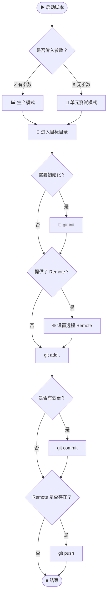

```mermaid
flowchart TD
    A([▶ 启动脚本]) --> B{是否传入参数？}

    B -- ✓ 有参数 --> C[🏭 生产模式]
    B -- ✗ 无参数 --> D[🧪 单元测试模式]

    C --> E[📁 进入目标目录]
    D --> E

    E --> F{需要初始化？}
    F -- 是 --> G[🔧 git init]
    F -- 否 --> H{提供了 Remote？}
    G --> H

    H -- 是 --> I[🌐 设置远程 Remote]
    H -- 否 --> J[git add .]
    I --> J

    J --> K{是否有变更？}
    K -- 是 --> L[git commit]
    K -- 否 --> M{Remote 是否存在？}
    L --> M

    M -- 是 --> N[git push]
    M -- 否 --> O
    N --> O([■ 结束])
```
