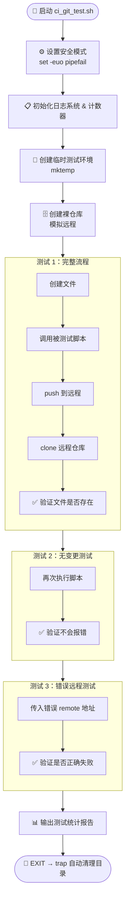

```mermaid
flowchart TD
    A([🚀 启动 ci_git_test.sh]) --> B

    B[⚙️ 设置安全模式\nset -euo pipefail] --> C
    C[📋 初始化日志系统 & 计数器] --> D
    D[📁 创建临时测试环境\nmktemp] --> E
    E[🗄️ 创建裸仓库\n模拟远程] --> T1

    subgraph T1 [" 测试 1：完整流程 "]
        direction TB
        t1a[创建文件] --> t1b[调用被测试脚本]
        t1b --> t1c[push 到远程]
        t1c --> t1d[clone 远程仓库]
        t1d --> t1e[✅ 验证文件是否存在]
    end

    T1 --> T2

    subgraph T2 [" 测试 2：无变更测试 "]
        direction TB
        t2a[再次执行脚本] --> t2b[✅ 验证不会报错]
    end

    T2 --> T3

    subgraph T3 [" 测试 3：错误远程测试 "]
        direction TB
        t3a[传入错误 remote 地址] --> t3b[✅ 验证是否正确失败]
    end

    T3 --> R
    R[📊 输出测试统计报告] --> X
    X([🧹 EXIT → trap 自动清理目录])
```
