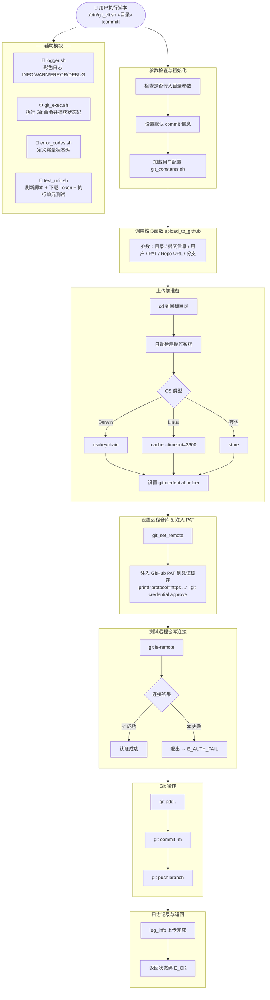

```mermaid
flowchart TD
    A([👤 用户执行脚本\n./bin/git_cli.sh &lt;目录&gt; &lsqb;commit&rsqb;]) --> B

    subgraph B [" 参数检查与初始化 "]
        direction TB
        b1[检查是否传入目录参数] --> b2[设置默认 commit 信息]
        b2 --> b3[加载用户配置 git_constants.sh]
    end

    B --> C

    subgraph C [" 调用核心函数 upload_to_github "]
        direction TB
        c1[参数：目录 / 提交信息 / 用户 / PAT / Repo URL / 分支]
    end

    C --> D

    subgraph D [" 上传前准备 "]
        direction TB
        d1[cd 到目标目录] --> d2[自动检测操作系统]
        d2 --> d3{OS 类型}
        d3 -- Darwin --> d4[osxkeychain]
        d3 -- Linux --> d5[cache --timeout=3600]
        d3 -- 其他 --> d6[store]
        d4 & d5 & d6 --> d7[设置 git credential.helper]
    end

    D --> E

    subgraph E [" 设置远程仓库 & 注入 PAT "]
        direction TB
        e1[git_set_remote] --> e2["注入 GitHub PAT 到凭证缓存\nprintf 'protocol=https ...' | git credential approve"]
    end

    E --> F

    subgraph F [" 测试远程仓库连接 "]
        direction TB
        f1[git ls-remote] --> f2{连接结果}
        f2 -- ✅ 成功 --> f3[认证成功]
        f2 -- ❌ 失败 --> f4[退出 → E_AUTH_FAIL]
    end

    F --> G

    subgraph G [" Git 操作 "]
        direction TB
        g1[git add .] --> g2[git commit -m]
        g2 --> g3[git push branch]
    end

    G --> H

    subgraph H [" 日志记录与返回 "]
        direction TB
        h1[log_info 上传完成] --> h2[返回状态码 E_OK]
    end

    subgraph LIBS ["── 辅助模块 ──"]
        direction LR
        L1[📝 logger.sh\n彩色日志 INFO/WARN/ERROR/DEBUG]
        L2[⚙️ git_exec.sh\n执行 Git 命令并捕获状态码]
        L3[🔢 error_codes.sh\n定义常量状态码]
        L4[🧪 test_unit.sh\n刷新脚本 + 下载 Token + 执行单元测试]
    end

    A -.-> LIBS
```
